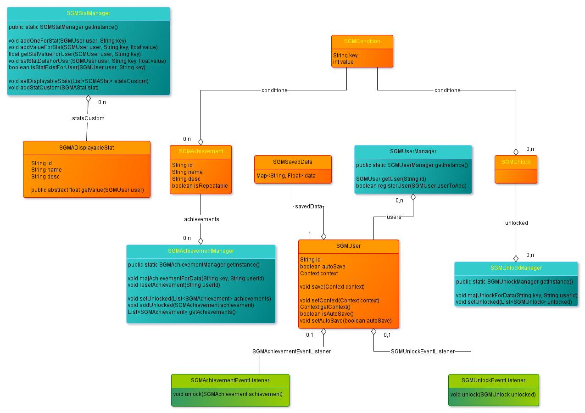

# SGM
SGM is a Game Manager to manage easly every features that you may need in a game developement.

Actual version : **0.8**

##Features
You can manage : 
* User : Load and save User easly. Automaticaly saved enable/disable data and stats.
* Achievement :  Each user can unlock achievements with a bunch of required stats. Each Achievement can be repetitive to be a daily quest.
* Unlock : Each user can unlock game content with a bunch of required stats.

##Android
Here you can find the diagram of Android part of SGM.

*Be carefull, yellow title are elements Work In Progress and may change in a futur version*
